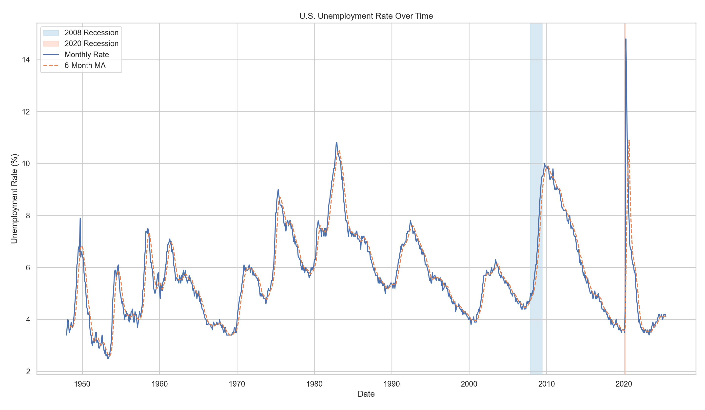

# U.S. Unemployment Analysis 

This project automates the download, cleaning, and visualization of the U.S. Unemployment Rate (`UNRATE`) time series from the Federal Reserve Economic Data (FRED) website. It uses Python with Selenium for automated data retrieval, and Pandas, Seaborn, and Matplotlib for analysis and visualization.

## Project Highlights

- Automated download of the latest UNRATE CSV from [FRED](https://fred.stlouisfed.org/series/UNRATE) using Selenium  
- Data cleaning and transformation with Pandas  
- Time series visualization with:  
  - Monthly unemployment rate  
  - 6-month moving average  
  - Clearly shaded recession periods (2008 and 2020)  
- Summary statistics printed to the console  

## File Structure

```
us-unemployment-analysis/
├── unrate_analysis.py           # Main Python script
├── UNRATE.csv                   # Downloaded dataset
├── unemployment_rate_trend.png  # Exported plot
└── README.md                    # Project documentation
```

## Technologies Used

- Python 3  
- Selenium  
- Pandas  
- Matplotlib  
- Seaborn  

## Sample Output

The output chart includes:  
- The raw monthly unemployment rate  
- A 6-month moving average line  
- Shaded recession periods in distinct colors



## Insights

- The **6-month moving average** smooths short-term noise, making long-term labor trends easier to see.  
- The **2008 financial crisis** led to a prolonged period of elevated unemployment, peaking around 10%.  
- The **2020 COVID-19 shock** triggered the steepest spike on record, with unemployment briefly reaching nearly 15%.  
- Recent data shows a strong recovery post-COVID, but with a slight uptick in the most recent months, possibly indicating economic cooling.  

## Getting Started

1. Clone the repo:

```bash
git clone https://github.com/yourusername/us-unemployment-analysis.git
cd us-unemployment-analysis
```

2. Install dependencies:

```bash
pip install -r requirements.txt
```

3. Run the script:

```bash
python unrate_analysis.py
```

## Requirements

To install manually, you need:

```
pandas
matplotlib
seaborn
selenium
```

Also make sure you have:
- Google Chrome installed
- The correct [ChromeDriver](https://sites.google.com/a/chromium.org/chromedriver/) in your system PATH

